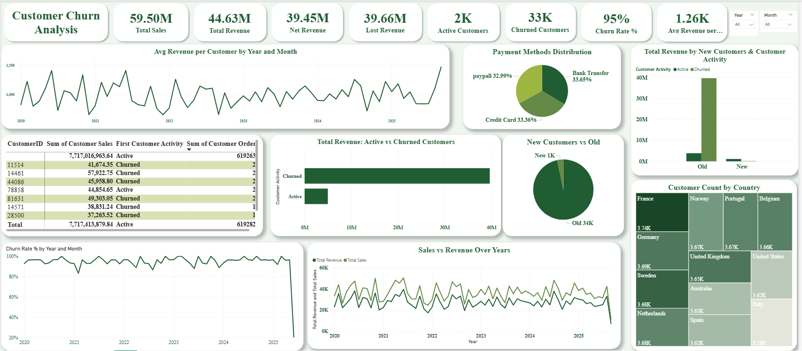

# Retail-Churn-Insights-2020-2025
Customer churn (2020–2025) | Excel, Python, Power BI dashboards.
## Business Question
Why was customer churn extremely high and active customer count very low from 2020 to 2024, and what caused the improvement in 2025?

---

## Project Overview
- Analyze customer churn trends using a retail dataset.
- Identify factors behind high churn and low active customers (2020–2024).
- Examine the sudden improvement in 2025, particularly in June.
- Provide actionable recommendations to sustain growth.

---

## Dataset & Columns

### Original Columns
- `InvoiceNo` – Unique invoice number per transaction  
- `StockCode` – Product code  
- `Description` – Product description  
- `Quantity` – Number of units purchased  
- `InvoiceDate` – Date of transaction  
- `UnitPrice` – Price per unit  
- `CustomerID` – Unique customer identifier  
- `Country` – Customer country  
- `Discount` – Discount applied to the order  
- `PaymentMethod` – Online or In-Store  
- `ShippingCost` – Shipping cost per order  
- `Category` – Product category  
- `SalesChannel` – Online / In-Store  
- `ReturnStatus` – Returned or not  
- `ShipmentProvider` – Shipping provider  
- `WarehouseLocation` – Warehouse of origin  
- `OrderPriority` – Priority of the order  

### Calculated Columns / Feature Engineering
- `Total Sales` = `Quantity * UnitPrice`  
- `Orders per Customer` – Total orders per customer  
- `Repeat Customer Flag` – Indicates if a customer has multiple orders  
- `First / Last Order Date` – Customer’s first and last purchase dates  
- `Customer Lifetime` – Time between first and last purchase  
- `Customer Type` – Segment based on RFM / behavior  
- `Days Since Last Order` – Recency metric  
- `Customer Activity` – Active vs churned customers based on recency  
- `Churn Flag` – Active if Recency < 90 days; Churned if Recency ≥ 90 days  

---

## Tools & Files

### 1️⃣ Full Report
- **Purpose:** Detailed report with all analysis, charts, insights, and recommendations  
- **File:**  
  - [Customer_Churn_Report.pdf](BusinessReport.pdf)  

### 2️⃣ Excel Analysis
- **Purpose:** Data cleaning, pivot tables, feature calculations, basic insights  
- **Files:**  
  - [Retail_Data_Analysis.xlsx](Excel/customerChurn.xlsx)  

### 3️⃣ Python Analysis
- **Purpose:** Advanced data cleaning, RFM analysis, churn classification, visualizations  
- **Files:**  
  - [Customer_Churn_Analysis.ipynb](Python/Customerchurn.ipynb)  

### 4️⃣ Power BI Analysis
- **Purpose:** Dashboards and interactive visualizations for churn trends, revenue, active vs churned customers, and KPI tracking  
- **Files:**  
  - [Customer_Churn_Dashboard.pbix](PowerBI/customerChurn.pbix)  
- **Dashboard :**
  - 
    
---

## Key Insights
- **2020–2024:** Churn ~97%, very few active customers, almost no new acquisitions.
- **2025:** Churn dropped to 61%; June saw churn fall from 96% → 21%, active customers rose to 23 (14 new).
- Orders slightly declined in June (26 vs. 29 monthly), but engagement was spread across more customers.
- Average revenue per customer increased, attracting fewer but higher-value customers.
- **Note:** Metrics are directional due to NULL CustomerID values.

---

## Recommendations
- Fix Customer Data for accurate churn, active, and revenue metrics.
- Maintain & strengthen retention strategies introduced in 2025.
- Nurture new customers into repeat, high-value customers; use early-stage incentives.
- Reward Loyal and Champion segments; proactively monitor “At Risk” customers.
- Link marketing acquisition channels to long-term customer behavior.
- Enhance overall customer experience to sustain growth.
